# DongqiudiPure-Android

[](https://github.com/CHOS1N11111/DongqiudiPure-Android/actions/workflows/android-checks.yml?query=branch%3Amain)
[](LICENSE)

基于 Kotlin 与 Jetpack Compose 的第三方懂球帝 Android 客户端。

## 功能

**资讯**

<table>
  <tr>
    <td align="center" width="33%">
      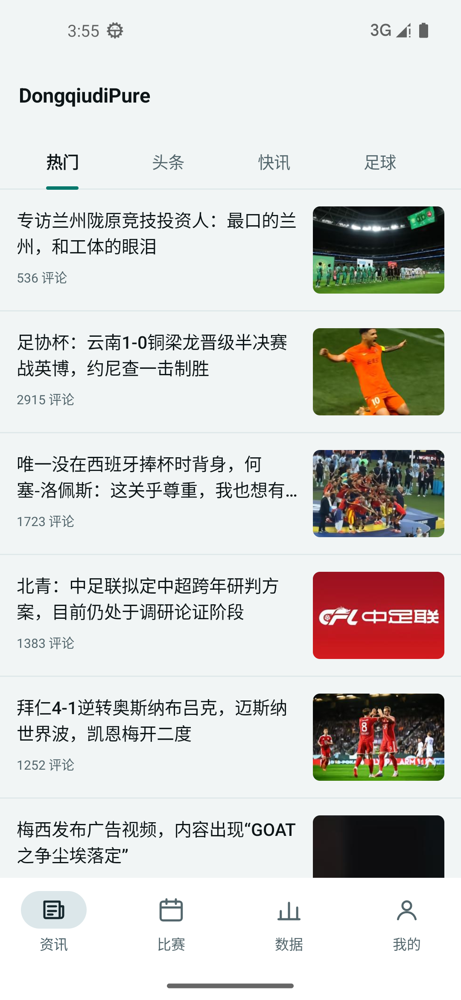<br />
      <sub>热门资讯列表</sub>
    </td>
    <td align="center" width="33%">
      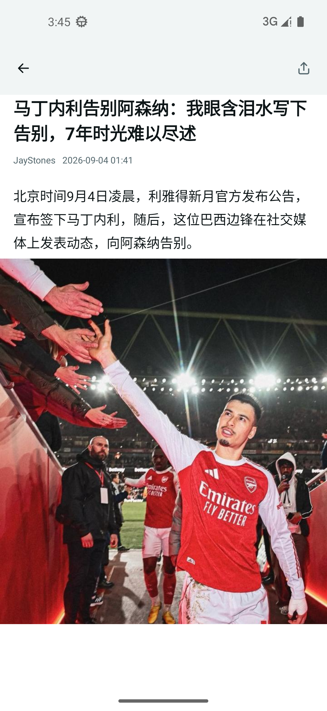<br />
      <sub>图文资讯详情</sub>
    </td>
    <td align="center" width="33%">
      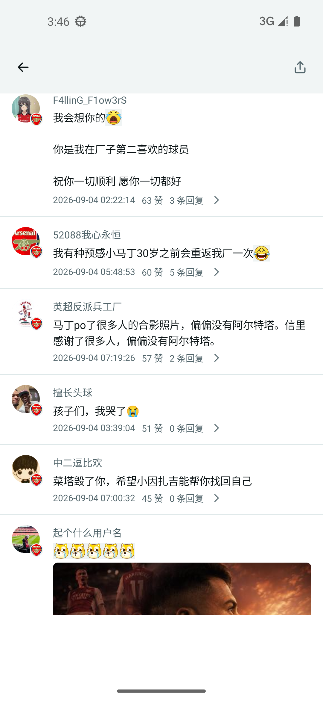<br />
      <sub>公开评论与回复</sub>
    </td>
  </tr>
</table>

- 默认展示「头条」，可在设置中选择其他栏目
- 资讯详情支持正文、图片、内嵌视频播放、系统分享，并可通过关联标签进入球队、球员或赛事资料页，支持评论查看
- 资讯设置支持搜索栏目、自定义首页栏目以及「仅展示足球资讯」过滤

**比赛**

<table>
  <tr>
    <td align="center" width="50%">
      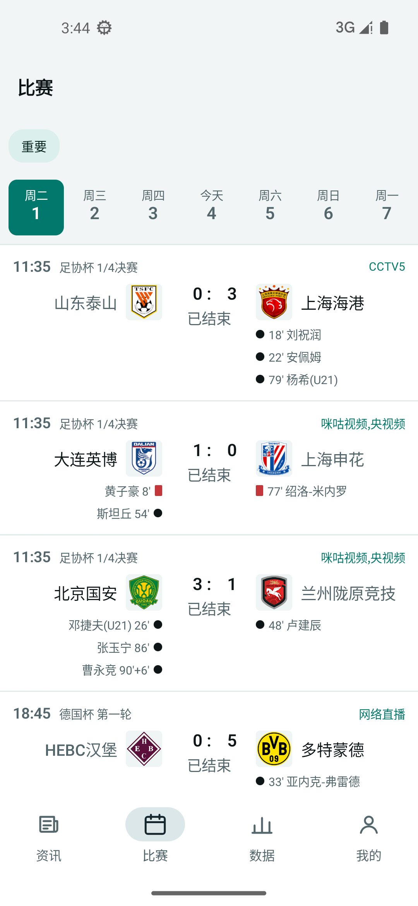<br />
      <sub>按日期查看比赛</sub>
    </td>
    <td align="center" width="50%">
      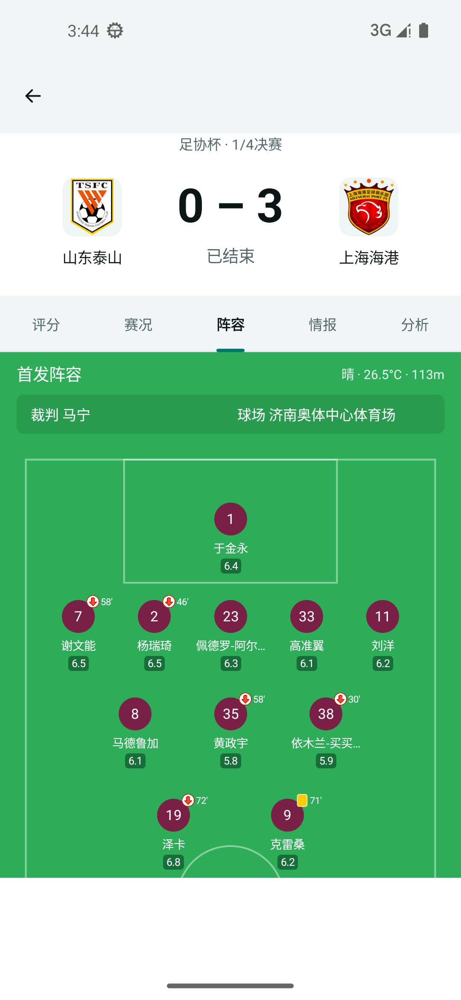<br />
      <sub>比赛阵容详情</sub>
    </td>
  </tr>
</table>

- 按日期查看以今天为中心的七天公开赛程与赛果，展示赛事分组、轮次、时间、状态、比分和球队队徽
- 「重要」默认包含五大联赛、中超、五大联赛国内杯赛、中国足协杯、欧冠、欧联、世界杯、亚洲杯、欧洲杯、美洲杯、亚冠精英和亚冠二级
- 可从赛事目录中搜索并添加顶部赛事
- 比赛详情包含「评分 / 赛况 / 阵容 / 情报 / 分析」五个栏目

**数据**

<table>
  <tr>
    <td align="center" width="50%">
      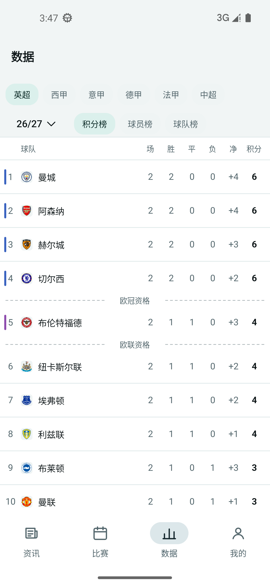<br />
      <sub>联赛积分榜</sub>
    </td>
    <td align="center" width="50%">
      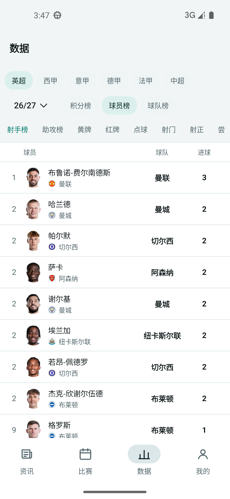<br />
      <sub>球员统计榜</sub>
    </td>
  </tr>
</table>

- 可在设置中搜索并选择公开赛事
- 支持切换当前赛事的赛季，查看「积分榜 / 球员榜 / 球队榜」
- 榜单中的球员和球队可直接进入对应资料页

**球队与球员**

<table>
  <tr>
    <td align="center" width="25%">
      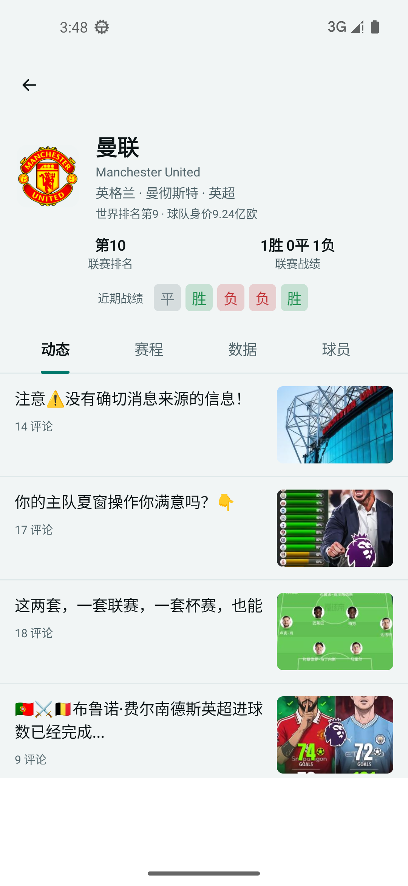<br />
      <sub>球队主页</sub>
    </td>
    <td align="center" width="25%">
      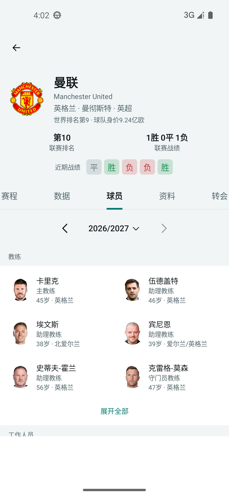<br />
      <sub>球队球员</sub>
    </td>
    <td align="center" width="25%">
      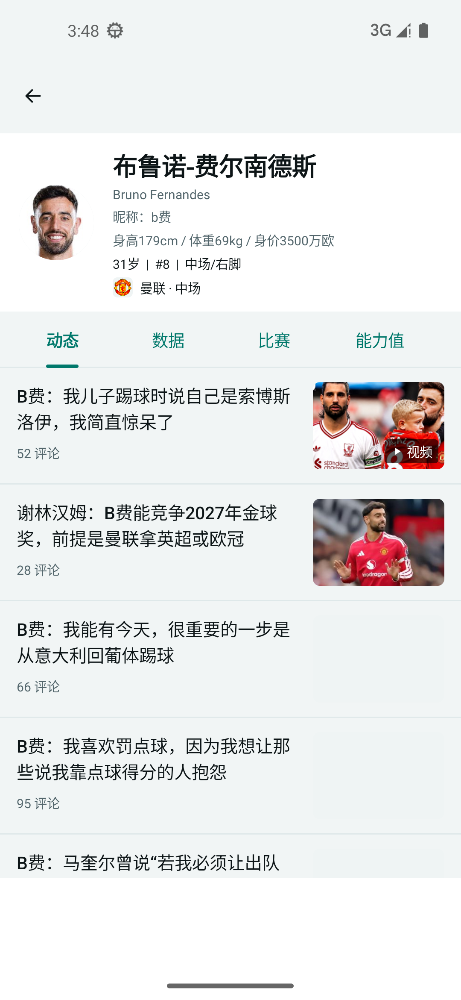<br />
      <sub>球员主页</sub>
    </td>
    <td align="center" width="25%">
      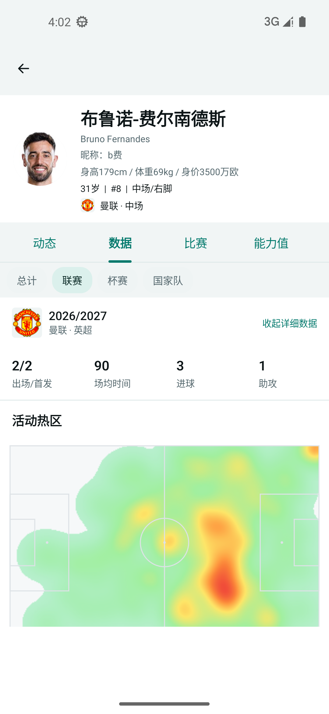<br />
      <sub>球员数据</sub>
    </td>
  </tr>
</table>

- 球队主页提供「动态 / 赛程 / 数据 / 球员 / 资料 / 转会」，展示真实队徽、基本资料、历年排名、历任主教练、荣誉、队史纪录、技战术特点和关键球员
- 球队赛程支持过去/未来、赛事、赛季与分页切换；阵容和数据可按赛季查看，转会可按窗口查看
- 球员主页提供「动态 / 数据 / 比赛 / 能力值 / 资料」，展示真实头像、所属球队、位置、号码和基本资料

**设置与本机体验**

<p align="center">
  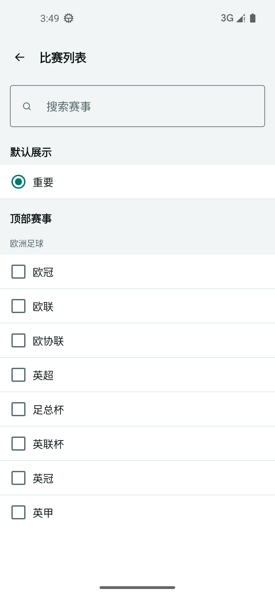<br />
  <sub>比赛赛事选择</sub>
</p>

- 底部导航固定为「资讯 / 比赛 / 数据 / 我的」
- 外观可选「跟随系统 / 浅色 / 深色」，资讯栏目、比赛赛事和数据赛事偏好保存在本机
- 不展示广告、赔率、盘口或其他博彩与体育投注内容

## 构建

开发环境需要 JDK 17 和 Android SDK 36；应用最低支持 Android 8.0（API 26）。

```bash
./gradlew assembleDebug
```

Debug APK 会生成在 `app/build/outputs/apk/debug/app-debug.apk`。

## 开源许可

DongqiudiPure-Android 以 [GPL-3.0-only](LICENSE) 发布，不提供任何担保。

## 声明

本项目与懂球帝及其官方运营方无隶属、授权或认可关系。

“懂球帝”及相关名称与标识归其各自权利人所有。
